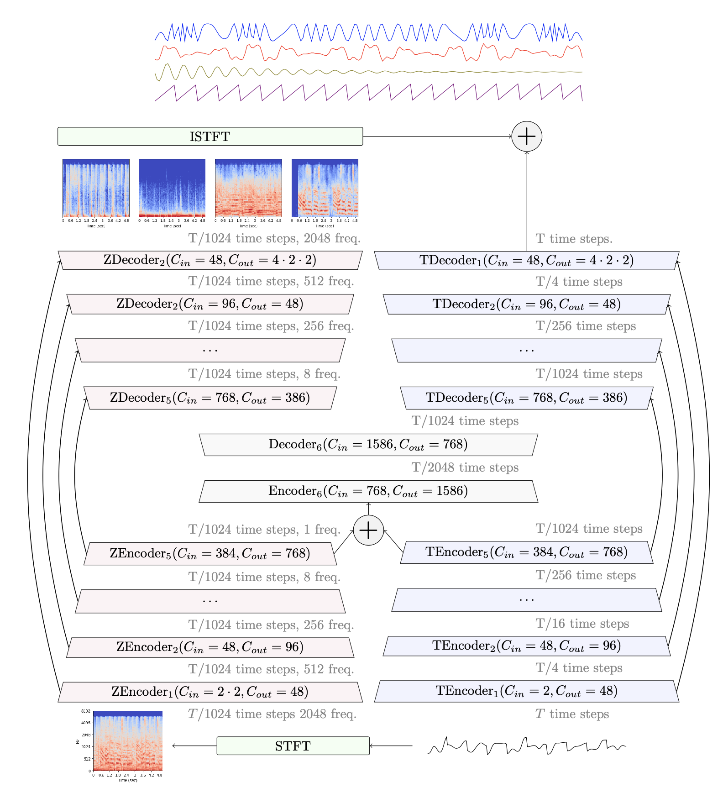

# Music Source Separation in the Waveform Domain

We provide an implementation of Demucs and Conv-Tasnet for music source separation on the [MusDB][musdb] dataset.
They can separate drums, bass and vocals from the rest with state-of-the-art results, surpassing previous waveform or spectrogram based methods.
The architecture and results obtained are detailed in our paper
[Music Source Separation in the waveform domain][demucs_arxiv].

Demucs is based on U-Net convolutional architecture inspired by [Wave-U-Net][waveunet] and
[SING][sing], with GLUs, a BiLSTM between the encoder and decoder, specific initialization of weights
and transposed convolutions in the decoder.

[Conv-Tasnet](https://arxiv.org/abs/1809.07454)
is a separation model developed for speech which predicts a mask on a learnt over-complete linear representation
using a purely convolutional model with stride of 1 and dilated convolutional blocks.
We reused the code from the [kaituoxu/Conv-TasNet][tasnet]
repository and added support for multiple audio channels.


When trained only on MusDB, Conv-Tasnet achieves higher SDR than Demucs (5.7 vs 5.6).
However, the audio it generates has significant artifacts as measured by human evaluations
(MOS is 3.2 for Demucs, 2.9 for Conv-Tasnet). When trained with extra training data,
Demucs and Conv-Tasnet obtain the same SDR. See [our paper][demucs_arxiv] Section 6 for more details or listen to our
[audio samples][audio] .

<p align="center">
</p>


## Important news if you are already using Demucs

- 13/04/2020: **Demucs released under MIT**: We are happy to release Demucs under the MIT licence.
    We hope that this will broaden the impact of this research to new applications.
- 13/04/2020: **New quantized models**: New quantized 8 bit models, 4 times smaller and with
    limited impact on quality. To use them, pass `-Q` to the `demucs.separate` command.
- 31/01/2020: **You will need to re-download pre-trained models**. Due to an incompatiblity with Pytorch 1.4.0, the pre-trained models could not be loaded
with it. I have replaced all the pre-trained models using a more future proof serialization. It means
that you will get an error if you update the repo saying that the previously downloaded checkpoints
don't have the right signature. Please delete the previously downloaded files in `models` and it will download the new ones.
Sorry for the inconveniance.
- 31/01/2020: **New light models**: I have added a lighter version of Demucs, trained with the option `--channels=64`.
The overall SDR is a bit worse, but to the hear it sounds quite similar. The files are smaller to download (1GB),
and it should run about 4x faster. I know quite a few people wanted to use Demucs on GPU, I hope this version
can run on a wider range of hardware :) To use it simply replace `-n demucs` by `-n light` (or `-n light_extra`
for the version trained on more data)
in the `separate` command described hereafter.

## Comparison with other models

An audio comparison of Demucs and Conv-Tasnet with other state-of-the-art methods such as [Wave-U-Net][waveunet], [OpenUnmix][openunmix] or
[MMDenseLSTM][mmdenselstm] is available on [the audio comparison page][audio].
We provide hereafter a summary of the different metrics presented in the paper.
You can also compare [Spleeter][spleeter], Open-Unmix, Demucs and Conv-Tasnet on one of my favorite
songs on our [soundcloud playlist][soundcloud].

### Comparison of accuracy

`Overall SDR` is the mean of the SDR for each of the 4 sources, `MOS Quality` is a rating from 1 to 5
of the naturalness and absence of artifacts given by human listeners (5 = no artifacts), `MOS Contamination`
is a rating from 1 to 5 with 5 being zero contamination by other sources. We refer the reader to our [paper][demucs_arxiv], Section 5 and 6,
for more details.

| Model         | Domain     | Extra data?  | Overall SDR | MOS Quality | MOS Contamination |
| ------------- |-------------| -----:|------:|----:|----:|
| [Open-Unmix][openunmix]      | spectrogram | no | 5.3 | 3.0 | 3.3 |
| [Wave-U-Net][waveunet]      | waveform | no | 3.2 | - | - |
| Demucs (this)      | waveform | no | 5.6 | **3.2** | 3.3 |
| Conv-Tasnet (this)     | waveform | no | **5.7** | 2.9 | **3.4** |
| Demucs  (this)    | waveform | 150 songs | **6.3** | - | - |
| Conv-Tasnet  (this)    | waveform | 150 songs | **6.3** | - | - |
| [MMDenseLSTM][mmdenselstm]      | spectrogram | 804 songs | 6.0 | - | - |
| [Spleeter][spleeter]  | spectrogram | undisclosed | 5.9 | - | - |


## Requirements

If you have anaconda installed, you can run from the root of this repository:

    conda env update -f environment-cpu.yml # if you don't have GPUs
    conda env update -f environment-cuda.yml # if you have GPUs
    conda activate demucs

This will create a `demucs` environment with all the dependencies installed.


### Using Windows

If you are using Windows, replace `python3` by `python.exe` in all the commands provided hereafter :)
Parts of the code are untested on Windows (in particular, training a new model). If you don't have much experience with Anaconda, python or the shell, here are more detailed instructions. Note that Demucs is not supported on 32bits systems (as Pytorch is not available there).

- First install Anaconda with **Python 3.7**, which you can find [here][install].
- Start the [Anaconda prompt][prompt].
- Type in the following commands:

```bash
cd %HOMEPATH%
conda install git
git clone https://github.com/facebookresearch/demucs
cd demucs
conda env update -f environment-cpu.yml
conda activate demucs
python.exe -m demucs.separate -d cpu --dl "PATH_TO_AUDIO_FILE_1" ["PATH_TO_AUDIO_FILE_2" ...]
```
The `"` around the filename are required if the path contains spaces.
The separated files will be under `C:\Users\YOUR_USERNAME\demucs\separated\demucs\`. The next time you want to use Demucs, start again the [Anaconda prompt][prompt] and simply run
```bash
cd %HOMEPATH%
cd demucs
conda activate demucs
python.exe -m demucs.separate -d cpu --dl "PATH_TO_AUDIO_FILE_1" ...
```

If you have an error saying that `mkl_intel_thread.dll` cannot be found, you can try to first run
`conda install -c defaults intel-openmp -f`. Then try again to run the `demucs.separate` command. If it still doesn't work, you can try to run first `set CONDA_DLL_SEARCH_MODIFICATION_ENABLE=1`, then again the `demucs.separate` command and hopefully it will work 🙏.
If you get a permission error, please try starting the Anaconda Prompt as administrator.

[install]: https://www.anaconda.com/distribution/#windows
[prompt]: https://docs.anaconda.com/anaconda/user-guide/getting-started/#open-prompt-win

### Using Mac OS X

If you do not already have Anaconda installed or much experience with the terminal on Mac OS X here are some detailed instructions:

1. Download Anaconda 3.7 64 bits for MacOS: https://www.anaconda.com/distribution/#download-section
2. Open Anaconda Prompt in MacOSX: https://docs.anaconda.com/anaconda/user-guide/getting-started/#open-nav-mac
3. Follow these commands:
```bash
cd ~
conda install git
git clone https://github.com/facebookresearch/demucs
cd demucs
conda env update -f environment-cpu.yml
conda activate demucs
python3 -m demucs.separate --dl -n demucs -d cpu PATH_TO_AUDIO_FILE_1
```
You can drag the .mp3 file to the console and it will paste the mp3 path.
To later reuse Demucs, simply start again the Anaconda Prompt and run
```bash
cd ~/demucs
conda activate demucs
python3 -m demucs.separate --dl -n demucs -d cpu PATH_TO_AUDIO_FILE_1
```
**If thats fails:**, replace `python3` by `python`.

## Separating tracks

In order to try Demucs or Conv-Tasnet on your tracks, simply run from the root of this repository

```bash
python3 -m demucs.separate --dl -n demucs PATH_TO_AUDIO_FILE_1 [PATH_TO_AUDIO_FILE_2 ...] # for Demucs
python3 -m demucs.separate --dl -n demucs --mp3 PATH_TO_AUDIO_FILE_1  # output files saved as MP3
python3 -m demucs.separate --dl -n demucs -Q PATH_TO_AUDIO_FILE_1 # Use quantized models (smaller download, slightly worse quality)
python3 -m demucs.separate --dl -n tasnet PATH_TO_AUDIO_FILE_1 ... # for Conv-Tasnet
# Demucs with randomized equivariant stabilization (10x slower, suitable for GPU, 0.2 extra SDR)
python3 -m demucs.separate --dl -n demucs --shifts=10 PATH_TO_AUDIO_FILE_1
```

If you have a GPU, but you run out of memory, please add `-d cpu` to the command line. See the section hereafter for more details on the memory requirements for GPU acceleration.

The `--dl`
flag will automatically download a pretrained model into `./models`. There will be one folder
per audio file, reusing the name of the track without the extension. Each folder will contain four stereo wav files sampled at 44.1 kHz: `drums.wav`, `bass.wav`,
`other.wav`, `vocals.wav`.
Those folders will be placed in `./separated/MODEL_NAME`.

Any stereo audio file supported by ffmpeg will work. It will be resampled to 44.1 kHz on the fly
if necessary. If multiple streams (i.e. a stems file) are present in the audio file,
the first one will be used.
The output will be a wave file, either in int16 format or float32 (if `--float32` is passed).
If you want to export as MP3 (at 320 kb/s), first install `lameenc` (on Windows `python.exe -m pip install -U lameenc`, 
on Linux/OSX `python3 -m pip install -U lameenc`, and use the `--mp3` flag.

Other pre-trained models can be selected with the `-n` flag and downloaded with the `--dl` flag.
The models will be stored in the `models` folder. The list of pre-trained models is:
- `demucs`: Demucs trained on MusDB,
- `demucs_extra`: Demucs trained with extra training data,
- `light`: Demucs trained on MusDB with `--channels=64` (smaller, faster, quality might be a bit worse),
- `light_extra`: Demucs trained with extra training data with `--channels=64`,
- `tasnet`: Conv-Tasnet trained on MusDB,
- `tasnet_extra`: Conv-Tasnet trained with extra training data.


For the `demucs*` and `light*` models, 8 bit quantized version are available.
The model is 4 times smaller but quality might be a bit worse, especially for the `other`
and `vocals` sources. Just add `-Q` to the command line to use them.


The `--shifts=SHIFTS` performs multiple predictions with random shifts (a.k.a randomized
equivariant stabilization) of the input and average them. This makes prediction `SHIFTS` times
slower but improves the accuracy of Demucs by 0.2 points of SDR.
It has limited impact on Conv-Tasnet as the model is by nature almost time equivariant.
The value of 10 was used on the original paper, although 5 yields mostly the same gain.
It is deactivated by default.


### Memory requirements for GPU acceleration

If you want to use GPU acceleration, you will need at least 8GB of RAM on your GPU for `demucs` and 4GB for `tasnet`. Sorry, the code for demucs is not super optimized for memory! If you do not have enough memory on your GPU, simply add `-d cpu` to the command line to use the CPU. With Demucs, processing time should be roughly equal to the duration of the track.


## Examining the results from the paper experiments

The metrics for our experiments are stored in the `results` folder. In particular
`museval` json evaluations are stored in `results/evals/EXPERIMENT NAME/results`.
You can aggregate and display the results using
```bash
python3 valid_table.py -p # show valid loss, aggregated with multiple random seeds
python3 result_table.py -p # show SDR on test set, aggregated with multiple random seeds
python3 result_table.py -p SIR # also SAR, ISR, show other metrics
```
The `std` column shows the standard deviation divided by the square root of the number of runs.

## Training Demucs and evaluating on the MusDB dataset

If you want to train Demucs from scratch, you will need a copy of the MusDB dataset.
It can be obtained on the [MusDB website][musdb].
To start training on a single GPU or CPU, use:
```bash
python3 -m demucs -b 4  --musdb MUSDB_PATH # Demucs
python3 -m demucs -b 4  --musdb MUSDB_PATH --tasnet --samples=80000 --split_valid # Conv-Tasnet
```
The `-b 4` flag will set the batch size to 4. The default is 4 and will crash on a single GPU.
Demucs was trained on 8 V100 with 32GB of RAM.
The default parameters (batch size, number of channels etc)
might not be suitable for 16GB GPUs.
To train on all available GPUs, use:
```bash
python3 run.py --musdb MUSDB_PATH [EXTRA_FLAGS]
```

This will launch one process per GPU and report the output of the first one. When interrupting
such a run, it is possible some of the children processes are not killed properly, be mindful of that.
If you want to use only some of the available GPUs, export the `CUDA_VISIBLE_DEVICES` variable to
select those.

To see all the possible options, use `python3 -m demucs --help`.

### About checkpointing

Demucs will automatically generate an experiment name from the command line flags you provided.
It will checkpoint after every epoch. If a checkpoint already exist for the combination of flags
you provided, it will be automatically used. In order to ignore/delete a previous checkpoint,
run with the `-R` flag.
The optimizer state, the latest model and the best model on valid are stored. At the end of each
epoch, the checkpoint will erase the one from the previous epoch.
By default, checkpoints are stored in the `./checkpoints` folder. This can be changed using the
`--checkpoints CHECKPOINT_FOLDER` flag.

Not all options will impact the name of the experiment. For instance `--workers` is not
shown in the name, therefore, changing this parameter will not impact the checkpoint file
used. Refer to [parser.py](demucs/parser.py) for more details.


### Test set evaluations

Test set evaluations computed with [museval][museval] will be stored under
`evals/EXPERIMENT NAME/results`. The experiment name
is the first thing printed when running `python3 run.py`  or `python3 -m demucs`. If you used
the flag `--save`, there will also be a folder `evals/EXPERIMENT NAME/wavs` containing
all the extracted waveforms.


#### Running on a cluster

If you have a cluster available with Slurm, you can set the `run_slurm.py` as the target of a
slurm job, using as many nodes as you want and a single task per node. `run_slurm.py` will
create one process per GPU and run in a distributed manner. Multinode training is supported.

### Extracting Raw audio for faster loading

We observed that loading from compressed mp4 audio lead to unreliable speed, sometimes reducing by
a factor of 2 the number of iterations per second. It is possible to extract all data
to raw PCM f32e format. If you wish to store the raw data under `RAW_PATH`, run the following
command first:

```bash
python3 -m demucs.raw [--workers=10] MUSDB_PATH RAW_PATH
```

You can then train using the `--raw RAW_PATH` flag, for instance:
```bash
python3 run.py --raw RAW_PATH --musdb MUSDB_PATH
```
You still need to provide the path to the MusDB dataset as we always load the test set
from the original MusDB.


### Results reproduction
To reproduce the performance of the main Demucs model in our paper:
```bash
# Extract raw waveforms. This is optional
python3 -m demucs.data MUSDB_PATH RAW_PATH
export DEMUCS_RAW=RAW_PATH
# Train models with default parameters and multiple seeds
python3 run.py --seed 42 # for Demucs
python3 run.py --seed 42 --tasnet --X=10 --samples=80000 --epochs=180 --split_valid # for Conv-Tasnet
# Repeat for --seed = 43, 44, 45 and 46
```

You can visualize the results aggregated on multiple seeds using
```bash
python3 valid_table.py # compare validation losses
python3 result_table.py # compare test SDR
python3 result_table.py SIR # compare test SIR, also available ISR, and SAR
```

You can look at our exploration file [dora.py](dora.py) to see the exact flags
for all experiments (grid search and ablation study). If you have a Slurm cluster,
you can also try adapting it to run on your own.


### Environment variables

If you do not want to always specify the path to MUSDB, you can export the following variables:
```bash
export DEMUCS_MUSDB=PATH TO MUSDB
# Optionally, if you extracted raw pcm data
# export DEMUCS_RAW=PATH TO RAW PCM
```

## How to cite

```
@article{defossez2019music,
  title={Music Source Separation in the Waveform Domain},
  author={D{\'e}fossez, Alexandre and Usunier, Nicolas and Bottou, L{\'e}on and Bach, Francis},
  journal={arXiv preprint arXiv:1911.13254},
  year={2019}
}
```

## License

Demucs is released under the MIT license as found in the [LICENSE](LICENSE) file.

The file `demucs/tasnet.py` is adapted from the [kaituoxu/Conv-TasNet][tasnet] repository.
It was originally released under the MIT License updated to support multiple audio channels.


[nsynth]: https://magenta.tensorflow.org/datasets/nsynth
[sing_nips]: https://research.fb.com/publications/sing-symbol-to-instrument-neural-generator
[sing]: https://github.com/facebookresearch/SING
[waveunet]: https://github.com/f90/Wave-U-Net
[musdb]: https://sigsep.github.io/datasets/musdb.html
[museval]: https://github.com/sigsep/sigsep-mus-eval/
[openunmix]: https://github.com/sigsep/open-unmix-pytorch
[mmdenselstm]: https://arxiv.org/abs/1805.02410
[demucs_arxiv]: https://hal.archives-ouvertes.fr/hal-02379796/document
[musevalpth]: museval_torch.py
[tasnet]: https://github.com/kaituoxu/Conv-TasNet
[audio]: https://ai.honu.io/papers/demucs/index.html
[spleeter]: https://github.com/deezer/spleeter
[soundcloud]: https://soundcloud.com/voyageri/sets/source-separation-in-the-waveform-domain
