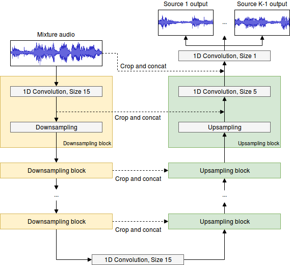

 # STL2 <!-- Your submission short name in <=4 characters -->
Daniel Stoller¹, Sebastian Ewert², Simon Dixon¹ <!-- Authors  -->

¹Queen Mary University London

²Spotify London <!-- Affiliations -->

Contact: d.stoller (AT) qmul.ac.uk <!-- one corresponding mail address -->

## Additional Info

* __is_blind:__ no  <!-- if you used supervised learning, answer no -->
* __additional_training_data:__ no  <!-- if you used more data than musdb (not including data augmentation)-->

## Supplemental Material

* __Code:__ [Tensorflow implementation](https://github.com/f90/Wave-U-Net)
* __Paper:__ [ArXiv preprint](https://arxiv.org/abs/1806.03185)

## Method

Task: Multi-instrument separation. For the same model applied to singing voice separation, see STL1 submission.

We use the Wave-U-Net, an adaptation of the U-Net architecture to the one-dimensional time domain to perform end-to-end audio source separation. Through a series of downsampling and upsampling blocks, which involve convolutions combined with a down-/upsampling process, features are computed on multiple scales/levels of abstraction and time resolution, and combined to make a prediction. Training is done on 75 MUSDB training set songs, validation with early stopping on the remaining 25 MUSDB songs, both from the training set. Training loss is the MSE on the raw audio source outputs.

A paper with more details, experiments and analysis is currently under review elsewhere.

## References

- Liutkus, Antoine and Fitzgerald, Derry and Rafii, Zafar: Scalable audio separation with light kernel additive modelling. 2015 IEEE International Conference on Acoustics, Speech and Signal Processing (ICASSP), 2015
- Ronneberger, O. and Fischer, P. and Brox, T.: U-net: Convolutional networks for biomedical image segmentation. International Conference on Medical Image Computing and Computer-Assisted Intervention, 2015
- Jansson, Andreas and Humphrey, Eric J. and Montecchio, Nicola and Bittner, Rachel and Kumar, Aparna and Weyde, Tillman: Singing Voice Separation with Deep U-Net Convolutional Networks. Proceedings of the International Society for Music Information Retrieval Conference (ISMIR), 2017.
- [Stoller, Daniel and Ewert, Sebastian and Dixon, Simon. Wave-U-Net: A multi-scale neural network for end-to-end source separation. Proceedings of the International Society for Music Information Retrieval Conference (ISMIR), 2018.](https://arxiv.org/abs/1806.03185)
